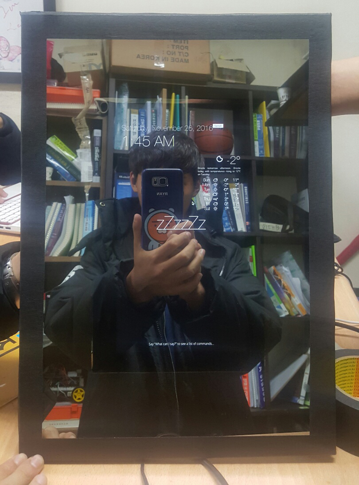

# 2조

## smart mirror  

디스플레이를 통해 사용자의 거울 속에서 정보 제공 & 음성인식 기능  

* 조장 : 김경륜(11학번)  
* 조원 : 김재우(13학번), 권수민(14학번), 배홍빈(16학번), 황재윤(16학번)  

***

### 개발환경  

* 사용보드 : Raspberry Pi 3  
* 운영체제 : Raspbian Jessie 16.05.27  
* 하드웨어 : Half Mirror (R70 : T30, A3 size), Monitor(HDMI cable, 12~18 inch)  
* Server : Node.js  
* Client : HTML, CSS, Javascript, jQuery, Angular.js, Electron.js  

*** 

### Problem Description  

거울은 사람들이 반드시 사용하는 물건인 동시에 가장 많은 시간을 할애하는 공간이기도 하다. 그런 거울 속에 하루의 필요한 정보를 담는다면 하루의 시작이 효율적일 것이다. 그 날의 날씨, 일정뿐만 아니라 사용자의 기분까지 고려하는 거울은 분명 유용할 것이다. 반투명 거울을 이용하여 모니터를 부착, 모니터를 통해 사용자에게 유용한 정보를 제공한다. 시간, 날짜, 그 날의 날씨, 일정뿐만 아니라 사용자의 기분을 고려하여 좋아하는 문구나 음악을 제공한다.  

***

### System capabilities  

1. 사물을 비춰주는 거울의 기능과 필요한 정보를 화면에 띄워주는 기능을 같이 구현한다.  
2. 라즈베리파이와 Wifi를 이용해 웹 API로 날씨정보홈페이지에서 날씨정보를 얻어 와서거울 화면에 당일 날씨를 확인할 수 있도록 한다.  
3. 일정을 미리 입력해놓으면, 해당 날짜 정해진 시간에 화면에 표시되도록 한다.  
4. 현재 시간을 화면에 표시되도록 한다.  
5. 음성인식기능을 추가해 사용자가 특정 명령어를 말하면, 사용자가 미리 설정한 음악을재생시킬 수 있도록 한다.  

***

### Business Benefits  

1. 아침에 준비하느라 늦는 일이 줄어들 것이고, 이후에 일정까지 생각하면서 준비할 수있어서 시간을 더 효율적으로 사용 할 수 있을 것이다.  
2. 하루의 시작을 자신이 좋아하는 음악과 함께하면서 기분이 좋아지고 이후에 일정에긍정적인 영향을 줄 수 있다.  
3. 나가기 전에 날씨정보를 미리 알 수 있어서 미리 대비할 수 있다.  

***

### Usecase Diagram  

  

*** 

### Activity Diagram  

  
  
  

***

### Reference  

https://github.com/evancohen/smart-mirror

***

### 발표자료  

[2조 스마트미러 발표자료](PPT/smart-mirror.pdf)