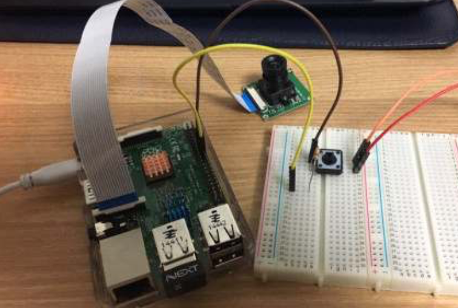

# 3조

## 안면인식을 통한 졸음운전 방지 시스템(미완성)  

OpenCV 라이브러리를 사용한 안면인식과 이를 통한 졸음운전 경고 기능 

  

* 조장 : 성지원(14학번)  
* 조원 : 한종원(12학번), 민창홍(14학번), 이재희(15학번), 한유성(16학번)  

***

### 개발환경

* 사용보드 : Raspberry Pi3  
* 사용언어 : C++  
* 라이브러리 : OpenCV  

***

### Problem Description  

졸음운전은 자동차 사고의 주요 원인 중 하나이다. 졸음운전을 예방하기 위해 운전자의 상태를 판단하여 경고를 할 수 있는 시스템을 구현해본다.

***

### System Capabilities  

* 운전자의 상태를 카메라를 통해 입력받는다.  
	* 운전자의 상태를 판단하는 것은 눈동자의 크기, 깜빡임의 주기, 고개를 떨구는 행위로 구분한다.(OpenCV 사용)  
* 운전자가 졸음운전 중이라는 결과가 나오면 경고를 준다.  
	* 경고는 청각, 촉각 등의 감각 중 가장 효과적인 방법을 모색한다.  
	* 경고의 정도는 운전자의 상태를 세 단계(일반영향권, 긴급영향권, 사고 발생권)로 나누어 다르게 준다.  

***

### 발표자료  

[3조 PPT](PPT/team3.pdf)