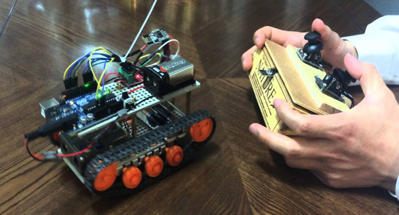

# 4조  

## 스마트 자동차  

아두이노와 라즈베리파이를 이용하여 만든 시각장애인을 위한 스마트 자동차     

* 조장 : 신대원(12학번)  
* 조원: 김용준(13학번), 강민경(15학번), 김동완(16학번)  

***

### 개발환경  

* 사용보드
	* Arduino Uno : 모형 자동차/컨트롤러 프로토타입 구현  
	* Raspberry Pi3 : 웹 서비스 구현  
* 추가 장비 : DC모터(4), 모터실드(2), 초음파 센서(2), 진동센서(2), 압력센서, 조이스틱 모듈, 블루투스 모듈(2), 파이카메라  

***  

### 시나리오  

*  이동수단의 혜택을 받지 못하던 시각 장애인들을 위해, 스스로 이용 가능한 운전보조 시스템과 자동 주행에 관한 기술이 부상하고 있다. 대표적인 예로, 데니스 홍 교수가 개발한 '시각장애인을 위한 자동차'가 있으며 이를 직접 구현해 보는 프로젝트를 진행한다.  

* 자동차와 이를 조종할 컨트롤러의 프로토 타입을 아두이노를 사용하여 개발한다. 컨트롤러는 조이스틱과 압력센서, 진동센서를 사용하고 블루투스 모듈을 통해 모형 자동차와 통신한다. 모형 자동차는 초음파 센서를 통해 장애물의 유무와 위치를 판단하여 모터의 동작을 멈출 수 있다. 또한 운전자는 컨트롤러의 부착된 진동센서를 통해 장애물의 위치를 알 수 있다.  

* 응급상황에 대리인이 원격으로 운전 할 수 있는 시스템을 구축한다. 대리인은 라즈베리파이에 로그인하여 파이카메라로 촬영한 영상을 웹 스트리밍 한다. 그리고 스트리밍 영상을 보며 웹을 통해 모형 자동차를 조종한다.  

***

### 발표자료  

* [PPT](PPT/team4.pdf)  
* [동영상: 라즈베리를 통한 웹 스트리밍](PPT/RPI_Webstreaming.mp4)  
* [동영상: 모형 자동차 주행 중 장애물 인식](PPT/Stop.mp4)  