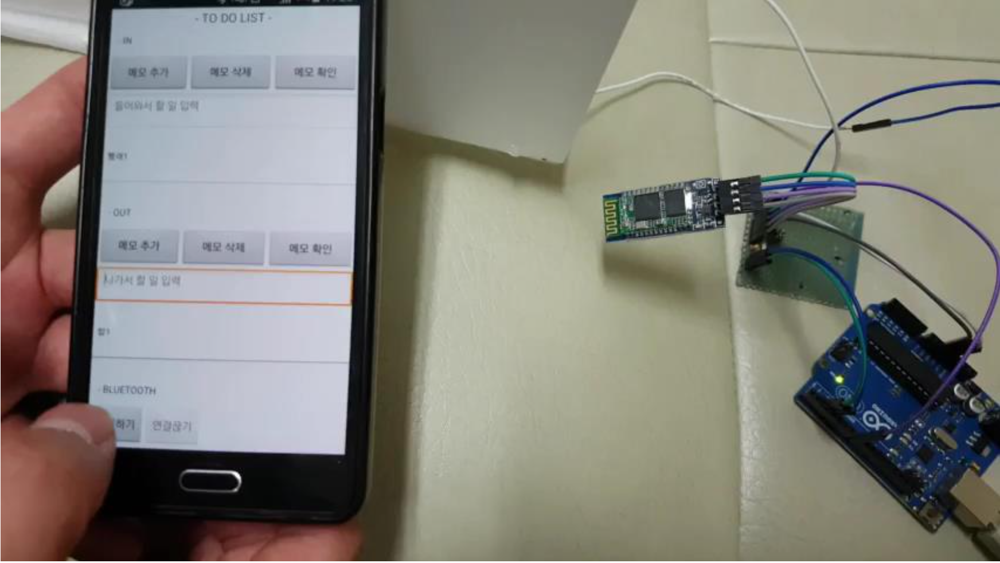

# 8조

## 재잘재잘 (스마트 할 일 관리 시스템)  

아두이노와 안드로이드 어플리케이션을 통한 할 일 관리 시스템  

* 조장 : 홍 솔(14학번)  
* 조원 : 강동재(13학번), 김태인(16학번), 이상웅(16학번), 조영준(16학번)  

***

### 개발환경  

* 사용보드 : Arduino UNO  
* IDE : Arduino IDE  
* 센서 : HC-06(Bluetooth Module)  

***

### 시나리오  

누구나 한 번쯤은 밖에서 할 일을 마치고 집에 돌아와서 '아 맞다. 이거 사왔어야 했는데...'라고 생각해 봤던 경험이 있을 것이다.  

만약 휴지가 필요한 상황에서, 외출 시 출입문의 동작을 감지하여 사용자가 집을 나갈 때 휴지를 사와야 함을 알려준다면 어떨가?  

이러한 어플리케이션은 사용자들의 일정과 할 일을 꼼꼼하게 챙겨 줌으로써 사용자들에게 해야 하는 일에 대해 기억해야 한다는 부담감을 덜어주는 비서 역할을 해 줄 것이다.  

***

### 영상  

[어플리케이션 동작 영상](PPT/video-1.mp4)  
[블루투스 연결 영상](PPT/video-2.mp4)  
[전체 실행 영상](PPT/video-3.mp4)  
